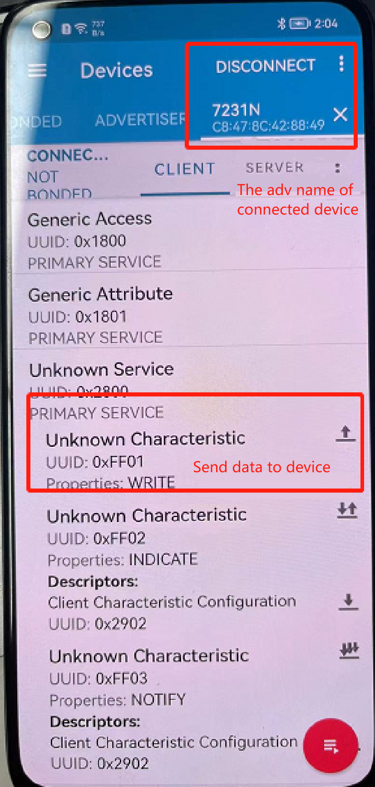
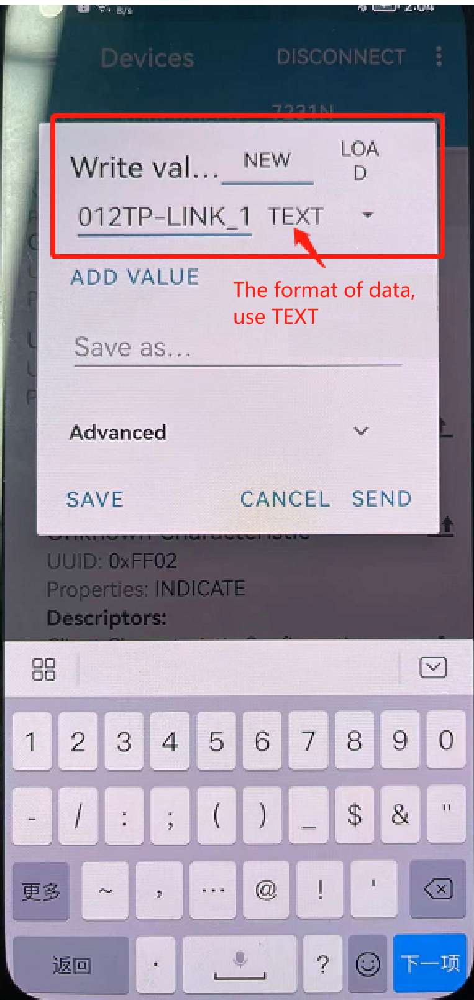

:link_to_translation:`zh_CN:[中文]`

HTTP instruction set
======================

--------------------------------------------
AT+HTTPCLIENT: send HTTP client requests
--------------------------------------------

**Execution command**

Command:
::

	AT+HTTPCLIENT=<opt>,<content-type>,<url>,[<host>],[<path>],<transport_type>[,<data>][,<http_req_header>][,<http_req_header>][...]

Return:
::

	+HTTPCLIENT:<size>,<data>
	OK
	//<size>: size is the length of received data.
	//<data>: data is the data responded by the server.

**Parameters**

- <opt>：HTTP client request method

	+ 1: HEAD
	+ 2: GET
	+ 3: POST
	+ 4: PUT
	+ 5: DELETE

- <content-type>: client request data type

	+ 0: application/x-www-form-urlencoded
	+ 1: application/json
	+ 2: multipart/form-data
	+ 3: text/xml

- <url>: HTTP URL, when followed by<host> and<path> When the parameter is empty, this parameter will automatically overwrite these two parameters.<host> :Domain name or IP address,<path> :HTTP path.
- <transport_type>: HTTP client transfer type, default value is 1.

	+ 1: HTTP_TRANSPORT_OVER_TCP
	+ 2: HTTP_TRANSPORT_OVER_SSL

- <data>: When <opt> is a POST request, this parameter is the data sent to the HTTP server. when <opt> is not a POST request, this parameter does not exist (that is, there is no need to enter a comma to indicate that this parameter exists).
- <http_req_header>: Multiple request headers can be sent to the server.

**Note**

- If the URL parameter is not empty, the HTTP client will use it and ignore the host parameter and path parameter. If the URL parameter is omitted or the string is empty, the HTTP client will use the host parameter and path parameter.

**Examples**
::

	//HEAD request
	AT+HTTPCLIENT=1,0,http://httpbin.org/get,httpbin.org,/get,1

	//GET request
	AT+HTTPCLIENT=2,0,http://httpbin.org/get,httpbin.org,/get,1

	//POST request
	AT+HTTPCLIENT=3,0,http://httpbin.org/post,httpbin.org,/post,1,field1=value1&field2=value2

	TLS example:
	//GET request
	AT+HTTPCLIENT=2,0,https://www.baidu.com/,www.baidu.com,/,2

	//POST request
	AT+HTTPCLIENT=3,0,https://www.baidu.com/,www.baidu.com,/,2,hello

-----------------------------------------------
AT+HTTPGETSIZE: get HTTP resource size
-----------------------------------------------

**Execution command**

Command:
::

	AT+HTTPGETSIZE=<url>

Return:
::

	+HTTPGETSIZE:<size>
	OK
	//<size>: the size of the URL resource

**Parameter**

- <url>：HTTP URL

**Example**
::

	AT+HTTPGETSIZE=http://www.baidu.com/img/bdlogo.gif

--------------------------------------------------
AT+HTTPCPOST: Post HTTP data of specified length
--------------------------------------------------

**Execution command**

Command:
::

	AT+HTTPCPOST=<url>,<length>[,<http_req_header_cnt>][,<http_req_header>..<http_req_header>]

Return:
::

	OK
	>

The symbol > indicates that AT is ready to receive serial port data. At this time, you can input data. When the data length reaches the value of the parameter <length>, click send to transfer the data. If the transfer is successful, return:
::

	SEND OK

If the transfer fails, return:
::

	SEND FAIL

**Parameters**

- <url>: HTTP URL
- <length>: HTTP data length required for POST, maximum length 2k
- <http_req_header_cnt>: the number of <http_req_header> parameter
- [<http_req_header>]: Multiple request headers can be sent to the server

**Example**
::

	AT+HTTPCPOST=http://httpbin.org/post,27
	
	>
	field1=value1&field2=value2

**Note**

- When POST sends data, \\r\\n cannot be used when entering data after >.

------------------------------------------------------
AT+HTTPCERT: Write CA certificate data to the device
------------------------------------------------------

**Execution command**

Command:
::

	AT+HTTPCERT=<type>,<length>

Return:
::

	OK

**Parameters**

- <type>: Writing certificate method

	- 1: Write the certificate data into RAM according to the value of <length>.
	- 2: Write the certificate data into RAM according to the length of the data sent through the serial port.

- <length>: Set according to the value passed by type. If it's 1, you need to know the size of the certificate and pass the corresponding value. If it's 2, any value is acceptable, but all the certificate data needs to be sent at once.

**Examples**
::

	AT+HTTPSCERT=1,1280

	-----BEGIN CERTIFICATE-----
	MIIDdTCCAl2gAwIBAgILBAAAAAABFUtaw5QwDQYJKoZIhvcNAQEFBQAwVzELMAkG
	A1UEBhMCQkUxGTAXBgNVBAoTEEdsb2JhbFNpZ24gbnYtc2ExEDAOBgNVBAsTB1Jv
	b3QgQ0ExGzAZBgNVBAMTEkdsb2JhbFNpZ24gUm9vdCBDQTAeFw05ODA5MDExMjAw
	MDBaFw0yODAxMjgxMjAwMDBaMFcxCzAJBgNVBAYTAkJFMRkwFwYDVQQKExBHbG9i
	YWxTaWduIG52LXNhMRAwDgYDVQQLEwdSb290IENBMRswGQYDVQQDExJHbG9iYWxT
	aWduIFJvb3QgQ0EwggEiMA0GCSqGSIb3DQEBAQUAA4IBDwAwggEKAoIBAQDaDuaZ
	jc6j40+Kfvvxi4Mla+pIH/EqsLmVEQS98GPR4mdmzxzdzxtIK+6NiY6arymAZavp
	xy0Sy6scTHAHoT0KMM0VjU/43dSMUBUc71DuxC73/OlS8pF94G3VNTCOXkNz8kHp
	1Wrjsok6Vjk4bwY8iGlbKk3Fp1S4bInMm/k8yuX9ifUSPJJ4ltbcdG6TRGHRjcdG
	snUOhugZitVtbNV4FpWi6cgKOOvyJBNPc1STE4U6G7weNLWLBYy5d4ux2x8gkasJ
	U26Qzns3dLlwR5EiUWMWea6xrkEmCMgZK9FGqkjWZCrXgzT/LCrBbBlDSgeF59N8
	9iFo7+ryUp9/k5DPAgMBAAGjQjBAMA4GA1UdDwEB/wQEAwIBBjAPBgNVHRMBAf8E
	BTADAQH/MB0GA1UdDgQWBBRge2YaRQ2XyolQL30EzTSo//z9SzANBgkqhkiG9w0B
	AQUFAAOCAQEA1nPnfE920I2/7LqivjTFKDK1fPxsnCwrvQmeU79rXqoRSLblCKOz
	yj1hTdNGCbM+w6DjY1Ub8rrvrTnhQ7k4o+YviiY776BQVvnGCv04zcQLcFGUl5gE
	38NflNUVyRRBnMRddWQVDf9VMOyGj/8N7yy5Y0b2qvzfvGn9LhJIZJrglfCm7ymP
	AbEVtQwdpf5pLGkkeB6zpxxxYu7KyJesF12KwvhHhm4qxFYxldBniYUr+WymXUad
	DKqC5JlR3XC321Y9YeRq4VzW9v493kHMB65jUr9TU/Qr6cf9tveCX4XSQRjbgbME
	HMUfpIBvFSDJ3gyICh3WZlXi/EjJKSZp4A==
	-----END CERTIFICATE-----

	AT+HTTPSCERT=2,0

	-----BEGIN CERTIFICATE-----
	MIIDdTCCAl2gAwIBAgILBAAAAAABFUtaw5QwDQYJKoZIhvcNAQEFBQAwVzELMAkG
	A1UEBhMCQkUxGTAXBgNVBAoTEEdsb2JhbFNpZ24gbnYtc2ExEDAOBgNVBAsTB1Jv
	b3QgQ0ExGzAZBgNVBAMTEkdsb2JhbFNpZ24gUm9vdCBDQTAeFw05ODA5MDExMjAw
	MDBaFw0yODAxMjgxMjAwMDBaMFcxCzAJBgNVBAYTAkJFMRkwFwYDVQQKExBHbG9i
	YWxTaWduIG52LXNhMRAwDgYDVQQLEwdSb290IENBMRswGQYDVQQDExJHbG9iYWxT
	aWduIFJvb3QgQ0EwggEiMA0GCSqGSIb3DQEBAQUAA4IBDwAwggEKAoIBAQDaDuaZ
	jc6j40+Kfvvxi4Mla+pIH/EqsLmVEQS98GPR4mdmzxzdzxtIK+6NiY6arymAZavp
	xy0Sy6scTHAHoT0KMM0VjU/43dSMUBUc71DuxC73/OlS8pF94G3VNTCOXkNz8kHp
	1Wrjsok6Vjk4bwY8iGlbKk3Fp1S4bInMm/k8yuX9ifUSPJJ4ltbcdG6TRGHRjcdG
	snUOhugZitVtbNV4FpWi6cgKOOvyJBNPc1STE4U6G7weNLWLBYy5d4ux2x8gkasJ
	U26Qzns3dLlwR5EiUWMWea6xrkEmCMgZK9FGqkjWZCrXgzT/LCrBbBlDSgeF59N8
	9iFo7+ryUp9/k5DPAgMBAAGjQjBAMA4GA1UdDwEB/wQEAwIBBjAPBgNVHRMBAf8E
	BTADAQH/MB0GA1UdDgQWBBRge2YaRQ2XyolQL30EzTSo//z9SzANBgkqhkiG9w0B
	AQUFAAOCAQEA1nPnfE920I2/7LqivjTFKDK1fPxsnCwrvQmeU79rXqoRSLblCKOz
	yj1hTdNGCbM+w6DjY1Ub8rrvrTnhQ7k4o+YviiY776BQVvnGCv04zcQLcFGUl5gE
	38NflNUVyRRBnMRddWQVDf9VMOyGj/8N7yy5Y0b2qvzfvGn9LhJIZJrglfCm7ymP
	AbEVtQwdpf5pLGkkeB6zpxxxYu7KyJesF12KwvhHhm4qxFYxldBniYUr+WymXUad
	DKqC5JlR3XC321Y9YeRq4VzW9v493kHMB65jUr9TU/Qr6cf9tveCX4XSQRjbgbME
	HMUfpIBvFSDJ3gyICh3WZlXi/EjJKSZp4A==
	-----END CERTIFICATE-----

----------------------------------------------------
AT+OTA: device OTA upgrade
----------------------------------------------------

**Execution command**

Command:
::

	AT+OTA=<url>

Return:
::

	OK
	//At the same time, download the upgrade file to Flash. After the download is completed, start the bootloader to upgrade.

**Parameter**

- <url>: HTTP URL of the upgrade file

**Example**
::

	AT+OTA=http://192.168.0.104/bk7231_bsp.rbl

----------------------------------------------------
AT+CWSTARTSMART: device provisioning selection
----------------------------------------------------

**Execution command**

Command:
::

	AT+CWSTARTSMART=<type>,<auth floor>

Return:
::

	OK

**Parameters**

- <type>: type

	- 1: ble
	- 2: AirKiss
	- 3: ble+AirKiss

- <auth floor>: Wi-Fi authentication mode threshold, this value is not used for the time being, the default value is 0.

	- 0: OPEN (default)
	- 1: WEP
	- 2: WPA_PSK
	- 3: WPA2_PSK
	- 4: WPA_WPA2_PSK
	- 5: WPA2_ENTERPRISE
	- 6: WPA3_PSK
	- 7: WPA2_WPA3_PSK

**Examples**
::

	AT+CWSTARTSMART =1,0
	AT+CWSTARTSMART =2,0
	AT+CWSTARTSMART =3,0

**Notes**

- The airkiss provisioning is through the Airkiss provisioning in the commonly used development tools for the Internet of Things in the WeChat applet. After the device sends the AT command, you can enter the account number and password in the applet.
- BLE  provisioning: The device sends the BLE broadcast name 7238 through the AT command. After NRF connect connects to the Bluetooth broadcast of the device, it chooses to send data to the device. The data format is TEXT. The data reference is as follows: 012TP-LINK_10860812345678

	- The first byte is the data type, and the default value is 0, which means sending the account number and password.
	- The second three bytes are the SSID length ssid_len such as 12.
	- The fourth to Nth bytes are the SSID string obtained through SSID, such as TP-LINK_1086.
	- The ssid_len+3+1 bytes to ssid_len+3+2 bytes are the password length password_len such as 08.
	- The ssid_len+5+1 to ssid_len+5+1+password_len bytes is the password string such as 12345678.

The BLE provisioning operation is shown in the figure:

    step 1

    step 2

----------------------------------------------------
AT+CWSTOPSMART: stop provisioning
----------------------------------------------------

**Execution command**

Command:
::

	AT+CWSTOPTSMART

Return:
::

	OK
