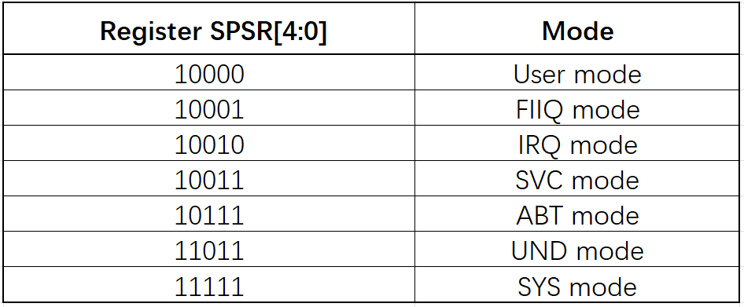

:link_to_translation:`zh_CN:[中文]`

===================
System debugging
===================

BK7238 system abnormal restart case analysis
==============================================

When a system exception occurs, the following log will be printed:

::

    data abort
    Current regs:
    r00:0x0040df91 r01:0x00001122 r02:0x00000000 r03:0x0000000a
    r04:0x00000001 r05:0x0040bc00 r06:0x0007cb81 r07:0x0040bba0
    r08:0x08080808 r09:0x09090909 r10:0x10101010
    fp :0x11111111 ip :0x00001868
    sp :0x004003d0 lr :0x0007cb5e pc :0x0007cb5e
    SPSR:0x0000003f
    CPSR:0x00000097
    
    separate regs:
    SYS:cpsr r8-r14
    0x0000009f
    0x08080808
    0x09090909
    0x10101010
    0x11111111
    0x00001868
    0x0041cd20
    0x0007cb7f
    
    IRQ:cpsr spsr r8-r14
    0x00000092
    0x6000001f
    0x08080808
    0x09090909
    0x10101010
    0x11111111
    0x00001868
    0x00401c08
    0x003f0fb4
    
    FIQ:cpsr spsr r8-r14
    0x00000091
    0x00000010
    0x00000000
    0x00000000
    0x00000000
    0x00000000
    0x00000000
    0x00400c18
    0x00e862ac
    
    ABT:cpsr spsr r8-r14
    0x00000097
    0x0000003f
    0x08080808
    0x09090909
    0x10101010
    0x11111111
    0x00001868
    0x004003c8
    0x0007cb5e
    
    UND:cpsr spsr r8-r14
    0x0000009b
    0x00000010
    0x08080808
    0x09090909
    0x10101010
    0x11111111
    0x00001868
    0x00400418
    0x9ec700a0
    
    SVC:cpsr spsr r8-r14
    0x00000093
    0x6000001f
    0x08080808
    0x09090909
    0x10101010
    0x11111111
    0x00001868
    0x004023d8
    0x00016e94
    
    shutdown...

First, keep the bk7231_bsp.elf file corresponding to the firmware version, dump it into an ASM file through ARM Toolchain. Use the following command:
::
  
  arm-none-eabi-objdump -d out/bk7231_bsp.elf >out/bk7231_bsp.asm

Find several key points from the exception log:

1.  SPSR register: 0x0000003f. Check the ARM mode table and you can see that it was SYS mode before the exception.
-------------------------------------------------------------------------------------------------------------------

    Figure 1 ARM Modes

2.  PC register: 0x7cb5e
--------------------------------------

The PC register is a general purpose register used to store the address of the exception handler. When an exception occurs (such as an interrupt or exception), the processor saves the current instruction address into the PC register and then jumps to the exception handler.

Check out the disassembly code near 0x7cb5e of bk7231_bsp.asm dumped above.

::

  0007cb50 <printf_data_data_abort>:
     7cb50: b510        push  {r4, lr}
     7cb52: 4903        ldr r1, [pc, #12] ; (7cb60 <printf_data_data_abort+0x10>)
     7cb54: 3001        adds  r0, #1
     7cb56: 8001        strh  r1, [r0, #0]
     7cb58: 4802        ldr r0, [pc, #8]  ; (7cb64 <printf_data_data_abort+0x14>)
     7cb5a: f79c f85d   bl  18c18 <bk_printf>
     7cb5e: bd10        pop {r4, pc}
     7cb60: 00001122  .word 0x00001122
     7cb64: 000a37c5  .word 0x000a37c5

  0007cb68 <data_abort_test>:
     7cb68: 200a        movs  r0, #10
     7cb6a: b510        push  {r4, lr}
     7cb6c: f023 ffd4   bl  a0b18 <__os_malloc_from_thumb>
     7cb70: 2300        movs  r3, #0
     7cb72: 54c3        strb  r3, [r0, r3]
     7cb74: 3301        adds  r3, #1
     7cb76: 2b0a        cmp r3, #10
     7cb78: d1fb        bne.n 7cb72 <data_abort_test+0xa>
     7cb7a: f7ff ffe9   bl  7cb50 <printf_data_data_abort>
     7cb7e: bd10        pop {r4, pc}

.. important::
  Since the ARM instruction execution method is a pipeline operation, that is, when the first instruction starts to be executed, the second instruction can be decoded and the third instruction can be fetched at the same time, the problem lies in the LDR instruction 0x7cb58.

From the exception log, we can see that r0=0x0040df91 is a non-four-byte aligned address, and a word read operation results in a non-aligned exception access.

3. SYS mode corresponds to r14 (LR) register: 0x7cb7f
------------------------------------------------------

- LR is used to assist PC pointer positioning problems.
- The LR register is a general-purpose register used to store the return address of a function call. When a function calls another function, the return address of the current function will be saved to the RA register so that after the sub-function is executed, it can correctly return to the next instruction of the calling function.
- During a function call, the value of the LR register is usually saved by the caller, and in the called function, it is used to save the return address. When the function executes the return instruction, the return address is read from the LR register and jumps to the corresponding location to continue execution.

