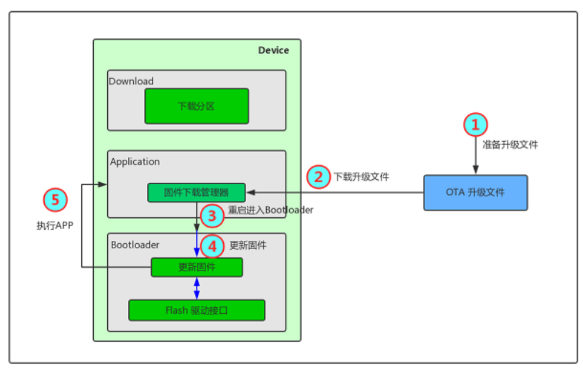

:link_to_translation:`zh_CN:[中文]`

Introduction to BK7238 compressed OTA upgrade
==============================================

1 Overview
----------------------------

 - Supports remote firmware upgrade on the network side, use http protocol to download ota firmware from the server, and then write it to the OTA partition. After the device is restarted, the bootloader will decompress and copy the firmware of the ota partition to the app running partition, and load the new app partition firmware.
 - The OTA RBL firmware supports compression and encryption, and OTA firmware production uses rt_ota_packaging_tool.

2 Introduction to OTA upgrade process
--------------------------------------

    Figure 1 OTA upgrade process

2.1 Make upgrade files 
::

    Enter the SDK directory and execute the following command to generate OTA firmware.
    $ ./tools/rtt_ota/rt_ota_packaging_tool_cli-x64 -f out/bk7231_bsp.bin -v 1.0.1 -o out/bk7238_ota.bin -p app -c lzma  -s aes -k 0123456789ABCDEF0123456789ABCDEF -i 0123456789ABCDEF

2.2 Download upgrade files

    - The corresponding download manager in the Application downloads the upgrade file to the OTA partition of Flash.
    - If there is no HTTP server, you can first set up a local HTTP Server environment to verify the function of HTTP OTA, and download MyWebServer3621.exe or other local http server tools by yourself.
    - Take MyWebServer3621.exe as an example: Click the Browse button, select the path to store the OTA firmware file generated in step 2.1, and click Start.
    - The URL is http://your_computer_ip/bk7238_ota.bin. After entering it in the browser, the bk7238_ota.bin can be downloaded, indicating that the environment is set up successfully.
    - The module is connected to the same router as the computer, and the connection is performed through CLI.

::

    Connect to router
    sta ssid password,

    Download firmware
    http_ota http://your_computer_ip/bk7238_ota.bin   

.. figure:: ../../_static/MyWebServer3621.png
    :align: center
    :alt: MyWebServer3621
    :figclass: align-center

    Figure 2 MyWebServer3621.exe interface

2.3 Restart and enter Bootloader 
    After downloading the upgrade file, the BK7238 will automatically restart the system and execute the Bootloader program.

2.4 Update firmware 
    The Bootloader program detects that there is an upgrade file in the OTA partition, performs the firmware decompression and update action, and checks the integrity and legality of the firmware.

2.5 Execute Application 
    After the firmware is updated and verified successfully, the Bootloader will guide the execution of the Application program and the upgrade is completed.

3 OTA upgrade failure analysis
-------------------------------
- Problem 1: OTA did not upgrade to the target program normally after restarting after downloading.
    First, make sure that the starting address and length of the OTA partition in the bootload partition table correspond to the starting address of the OTA partition in the code partition table. For partition table division, please refer to: doc:`/developer-guide/partition_specification/index`.

- Problem 2: OTA download not completed
    First, confirm whether the module RF parameters have been calibrated, and also check whether the network environment is normal.
