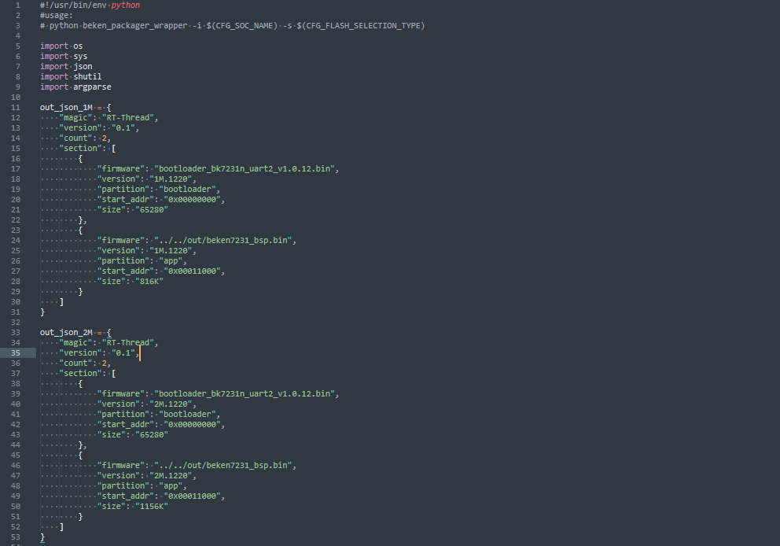
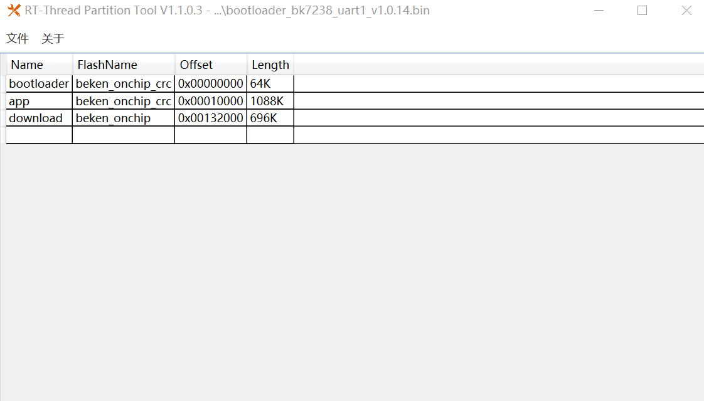

:link_to_translation:`zh_CN:[中文]`

Partition modification specifications
======================================

Introduction to the relationship between physical address and logical address
------------------------------------------------------------------------------

In order to ensure the accuracy of the data stored in the flash, 2 bytes of crc check bits will be added for every 32 bytes (the CRC check is automatically completed by the hardware). The comparison relationship is shown in Figure 1 below (The left side is the logical address, the right side is the physical address, the red font is CRC check):

.. figure:: ../../_static/logic.png
    :align: center
    :alt: logic
    :figclass: align-center

    Figure 1 Comparison of physical address and logical address

Composition of partition modification
--------------------------------------
Modifying a partition involves four parts:

.. important::
  - Partition table planning
  - Modification of the configuration file of the packaging script
  - Bootloader partition table modification

Case
----------------------------

Taking BK7238 as an example, when the user adds code based on the SDK, the following compilation error occurs, as shown in Figure 2. What should do?

.. figure:: ../../_static/build_fail_1.png
    :align: center
    :alt: build_fail_1
    :figclass: align-center

    Figure 2 Compilation error

.. figure:: ../../_static/out_bin_1.png
    :align: center
    :alt: out_bin_1
    :figclass: align-center

    Figure 3 Compiled output firmware

There are two solutions:

.. important::
  - Solution 1: Check the size of bk7238_crc.bin, if it exceeds the APP partition a little, you can reduce the code size by disabling some unnecessary functions. If the exceeded code size is large, you can only implement Solution 2.
  - Solution 2: If the exceeded code size is large, you need to modify the partition table again.

The steps to create a partition table are as follows:

- 1.APP partition table production:

  If the total physical length of flash is 2M, the partition_start_addr (physical address) and partition_length (physical length) of each partition need to be set in beken378/func/user_driver/BkDriverFlash.c.

.. figure:: ../../_static/bk_partition.png
    :align: center
    :alt: bk_partition
    :figclass: align-center

    Figure 4 Partition table

- 2.Packaging script configuration:

  Just modify the start_addr and size in tools/beken_packager/beken_packager_wrapper according to the size of each partition in the partition table in Figure 4, where start_addr = partition_start_addr, size = partition_length.

    Figure 5 Packaging script configuration

  
- 3.Use the rt_partition_tool.exe in tools/rt_partition_tool/rt_partition_tool.exe to modify the partition table and insert the new bootloader partition table as shown in Figure 6. The brief steps are as follows:

  - Open rt_partition_tool.exe
  - Load tools/beken_packager/bootloader_bk7238_uart1_v1.0.14.bin
  - Modify the corresponding partition table. Note that offset and length here are both logical addresses, that is, without CRC.
  - Click File and save the partition table to bootloader

    Figure 6 RT partition tool

Introduction to partition functions
------------------------------------

The functions of each partition are shown in the table below.

+------------------+---------------+----------------+--------------------------------------------+
| Partition name   | Start address | Length         | Functional description                     |
+==================+===============+================+============================================+
| bootloader       | 0x00000000    | 0xf000         | Store bootloader                           |
+------------------+---------------+----------------+--------------------------------------------+
| app              | 0x11000       | 0x121000       | Store application image                    |
+------------------+---------------+----------------+--------------------------------------------+
| ota              | 0x132000      | 0xAE000        | Store updated image                        |
+------------------+---------------+----------------+--------------------------------------------+
| RF_Firmware      | 0x1E1000      | 0x1000         | Store calibration parameter                |
+------------------+---------------+----------------+--------------------------------------------+
| NEI_info         | 0x1E2000      | 0x1000         | Store Wi-Fi MAC address and fast           |
|                  |               |                | connection parameter                       |
+------------------+---------------+----------------+--------------------------------------------+

