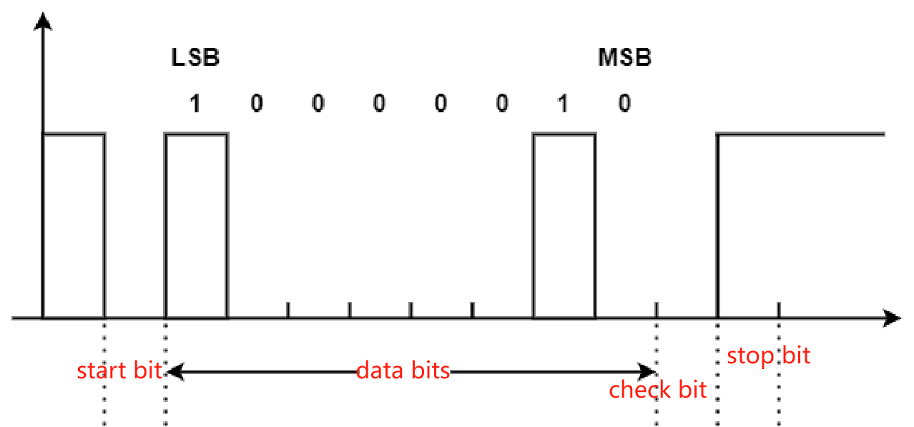

:link_to_translation:`zh_CN:[中文]`

==================
UART User Guide
==================

Overview
==================

UART (Universal Asynchronous Receiver and Transmitter)
--------------------------------------------------------
The BK7238 includes two Universal Asynchronous Receiver Transmitter (UART) interfaces that provide full-duplex asynchronous serial communication at baud rates up to 6 Mbps. They support 5/6/7/8-bit data, as well as even, odd, or no parity. Stop bits can be 1 or 2 bits. UART1 supports Flash download.

.. figure:: ../../_static/uart.png
    :align: center
    :alt: UART Connection
    :figclass: align-center

    UART Connection

The figure above shows the TTL level hardware connection of the UART serial port , where:
 
 - TXD: used to send data, should be connected to the RXD pin of the receiving device.
 - RXD: used to receive data, should be connected to the TXD pin of the sending device.
 - GND: provides an identical reference level for both sides.

UART configuration
==================

In order to use UART for data transmission, you usually need to configure the following parameters:
 
 - Baud rate: the number of bits transmitted per second, usually 9600, 19200, 115200 and other options
 - Data bits: The data can be 5, 6, 7, or 8 bits. Generally, we transmit data in bytes (8 bits). The transmitter changes the status of the data line (high level or low level) bit by bit to send them out. When transmitting data, the LSB is transmitted first and the MSB is transmitted last.
 - Parity bits: used to verify the correctness of data transmission. It can only detect errors but cannot correct them.
 - Stop bits: used to indicate that the current data transmission is completed, which is logic 1.

UART timing
==================

    UART Timing

The figure above shows 8 data bits + 1 even parity bit + 1 stop bit for sending the waveform of 'A' (0x41). The binary number of 'A'is 01000001. The transmission is little-endian, that is, LSB comes first and MSB comes last.
 
 - When idle, the data line is high.
 - Start bit: When data needs to be sent, UART will change the state of TXD to low level.The start bit is usually 1 bit.
 - Data bits, the transmitter changes the state of the data line (high level or low level) one by one and transmits them out. First, bit[0] is transmitted, and its value is 1; then bit[1] is sent, and its value is 0, and so on.
 - Parity bits, even parity: data bits + the number of bits with a check bit value of 1 is an even number, so the parity bit is low level.
 - Stop bits: because the stop bit is configured as 1 bit, so the stop bit is high level

UART transmission
==================

The packet transmission channel is as follows:

 - The application can call bk_uart_send() to send packets.
 - UART hardware transmission

UART receiption
==================

.. figure:: ../../_static/uart_recv.png
    :align: center
    :alt: UART Receive Data
    :figclass: align-center

    UART data reception 

The UART packet receiption channel is shown in the figure above.

 - UART packet reception interruption:
   When the UART RX or UART RX Finish interrupt occurs, the software enters the UART interrupt processing function. The UART interrupt reads data from the hardware FIFO and puts it into the RX FIFO. If there are applications waiting for data at this time, the UART will wake up the application to receive the packet.

 - UART application packet reception:
   When the application calls bk_uart_recv(), data will be read from the UART RX FIFO. When there is no data in the UART RX FIFO, if the timeout is set to 0, then bk_uart_recv() will return immediately, otherwise it will wait until timeout or new data is received in UART RX FIFO.
   
UART flow control
==================

When the rate at which the UART interrupt retrieves packets from the UART HW FIFO is less than the rate at which the UART hardware fills the packets into the HW FIFO, the UART HW FIFO will be full. If UART hardware flow control is enabled, the UART hardware will notify the transmitter to stop sending packets, otherwise packet loss will occur.

In the same way, when the rate at which the UART application fetches packets from the SW FIFO is less than the rate at which the UART interrupt fills the SW FIFO with packets, the UART SW FIFO will be full. When the SW FIFO is Full, the interrupt will read the data in the hardware FIFO and discard it. At this time, a log of "rx kfifo is full" will be printed. When this situation occurs, it may affect application functions. Usually the solution is to increase the application processing rate, such as increasing the priority of application tasks, etc.

  
UART application scenarios
============================

Currently UART supports two different application methods:

 - Use default UART interrupt processing flow: Use the default bk_uart_send()/bk_uart_recv to transmit and receive UART packets. The transmission and reception channels are as described in the above sections. Usually this method can meet the needs of most applications.
 - Use the default UART interrupt processing flow and register user callback: Same as the first method, the only difference is that after the UART interrupt is generated, the callback registered by the user will be called.

Use routines
==================

::

    const bk_uart_config_t uart1_config[] =
    {
      [0] =
      {
          .baud_rate     = 115200,
          .data_width    = BK_DATA_WIDTH_8BIT,
          .parity  = BK_PARITY_NO,
          .stop_bits = BK_STOP_BITS_1,
          .flow_control = FLOW_CTRL_DISABLED,
          .flags   = 0,
      }
    }

    char send_buf[4]={0x11,0x22,0x33,0x44};

    bk_uart_initialize(UART1_PORT, &uart1_config[0], NULL);  //Initialize the serial port

    bk_uart_send(UART1_PORT, send_buf, 4);   //UART write

    bk_uart_recv(UART1_PORT, send_buf, 4, 0);  //UART read
