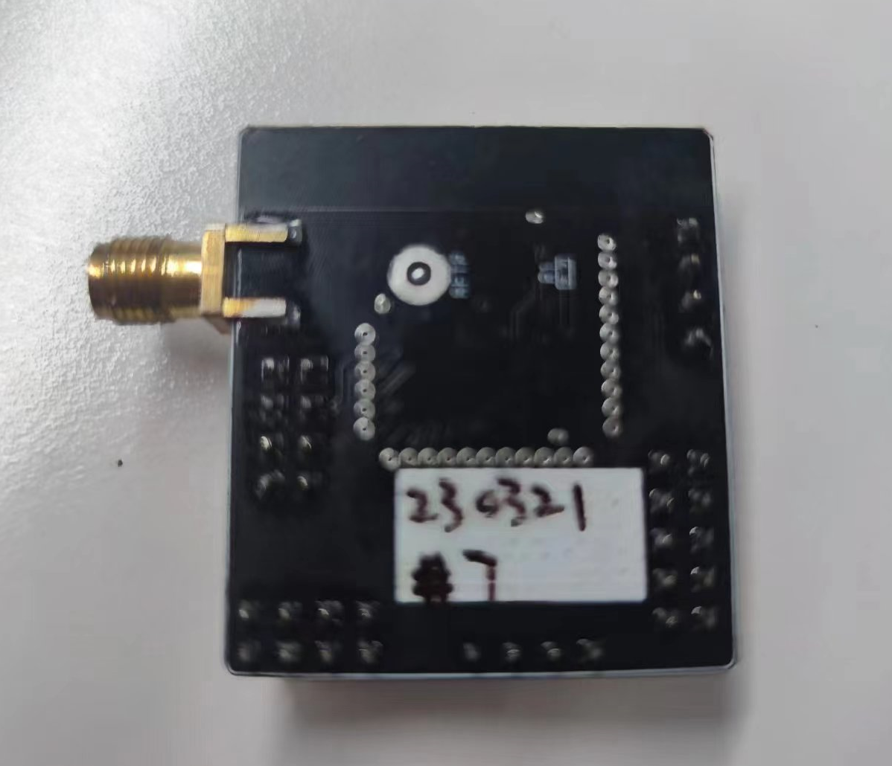
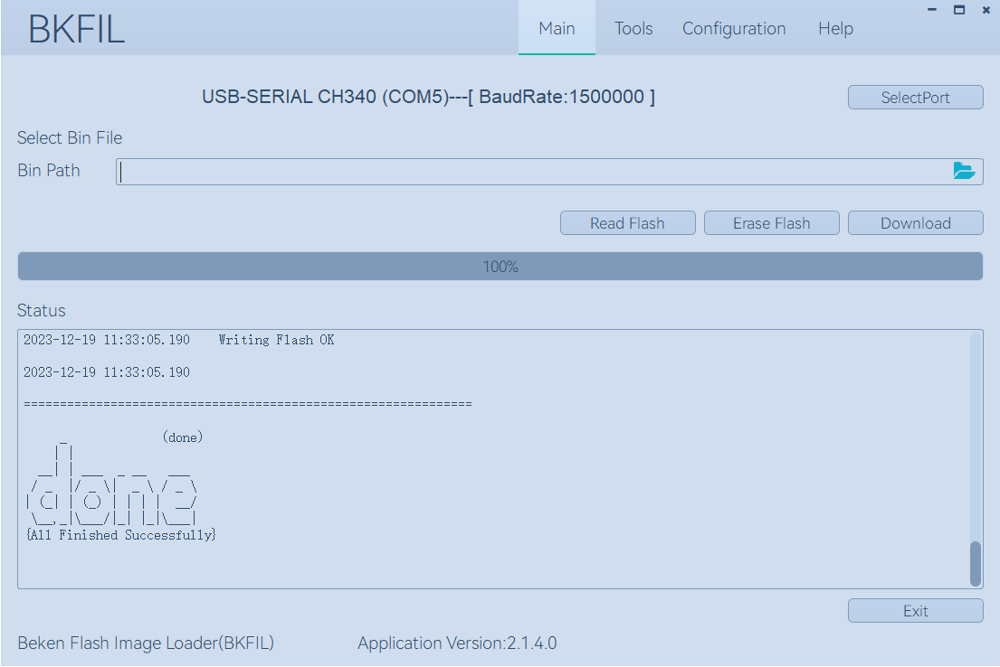

:link_to_translation:`zh_CN:[中文]`

Quick start
=======================

This document takes the BK7238 development board as an example to show you the following through a simple example project:

 - How to set up the BK7238 SDK compilation environment.
 - How to compile and download firmware.

------------------------
Preparation
------------------------

Hardware:
------------------------

 - BK7238 development board
 - Serial port burning tool
 - Computer (Windows and Ubuntu)

Software:
------------------------

 - ARM cross toolchain for compiling BK7238 SDK
 - BK7238 SDK source code
 - Serial port burning software

------------------------------------
Introduction to development board
------------------------------------

.. figure:: ./../_static/demo_board_bk7238_1.png
    :align: center
    :alt: demo_board_bk7238_1
    :figclass: align-center

    BK7238 demo board

    BK7238 demo board back side

------------------------------------
Build a compilation environment
------------------------------------

BK7238 SDK code download
------------------------------------

You can download BK7238 SDK from gitlab::

    git clone -b SDK_3.0.X https://gitlab.bekencorp.com/wifi/beken_freertos_sdk_release.git

You can also get the BK7238 SDK from Beken agents.

.. note::
    Download the latest SDK code from gitlab on the official website. Find the project to apply for the relevant account.

Toolchain installation
------------------------

The toolchain is located in the SDK_DIR/toolchain directory, such as gcc-arm-none-eabi-5_4-2016q3.tar.bz2.

Use the following command to extract it to the user directory, /home/your_user_name/toolchain directory::
    
    $ mkdir /home/your_user_name/toolchain
    $ tar -xvf toolchain/gcc-arm-none-eabi-5_4-2016q3.tar.bz2 -C  /home/your_user_name/toolchain

Environment variables
------------------------
To add the toolchain to the environment variables, first open the environment configuration file::

    $ vim ~/.bashrc

Write the following content to the configuration file::

    export FREERTOS_EXEC_PATH=/home/your_user_name/toolchain/gcc-arm-none-eabi-5_4-2016q3/bin/

Enable environment variables::

    $ source ~/.bashrc

.. note::
    Compilation in the Linux environment is currently supported. This chapter will take Ubuntu 20.04 LTS version as an example to introduce the construction of the entire compilation environment. The above your_user_name needs to be changed to the user name of your own host.

Compile project
------------------------------------

Enter the BK7238 SDK directory in the terminal, perform compilation, and generate the default firmware::

   $ make bk7238 -j4

To compile the Matter version, you can enable the Matter macro in sys_config_bk7238.h, such as::

#define CFG_SUPPORT_MATTER   1

hen execute the compilation command to generate Matter firmware::   

   $ make bk7238 -j4

.. note::
    To compile Matter, you need to use a newer version of the compiler, such as  `gcc-arm-none-eabi-10.3-2021.10 <https://developer.arm.com/downloads/-/gnu-rm/10-3-2021-10>`_.
    You also need to install the Matter compilation environment, see `Introduction to Matter <https://gitlab.bekencorp.com/wifi/customer/matter>`_.

------------------------------------
Burn code
------------------------------------

On Windows platform, BK7238 currently supports UART burning.

Burn via serial port
------------------------------------

.. note::

    BK7238 supports UART burning, and it is recommended to use the CH340 serial port tool board for downloading.

The serial port burning tool is shown in the figure below:

.. figure:: ./../_static/download_tool_uart.png
    :align: center
    :alt: download_tool_uart
    :figclass: align-center

    UART

Obtain the burning tool:

	Get the latest version of the burning tool online: http://dl.bekencorp.com/tools/flash/，如：BEKEN_BKFIL_V2.0.10.6_20230615.zip

The bk_writer.exe interface and related configurations are shown in the figure below：

    BKFIL GUI

Burn the serial port UART1, click ``Burn`` to burn the version. After the burning is completed, power off and restart the device.

Serial port log and command Line
------------------------------------

- Currently on the BK7228 platform, the serial port log and command line commands are input through the UART1 port. You can view the list of supported commands through the help command::

    help //Output the commands supported by SDK

.. figure:: ./../_static/cli_help.png
    :align: center
    :alt: cli_help
    :figclass: align-center

