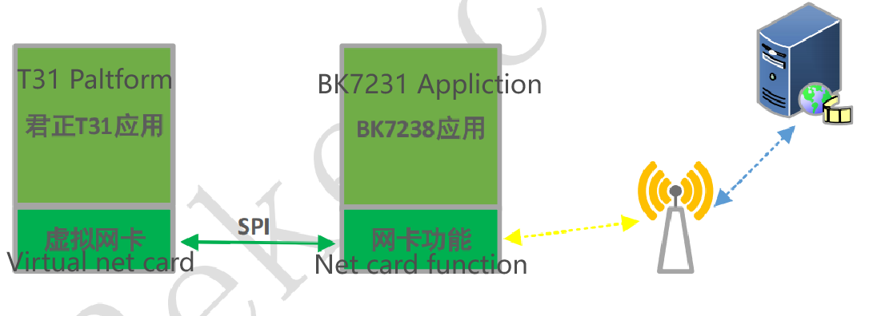
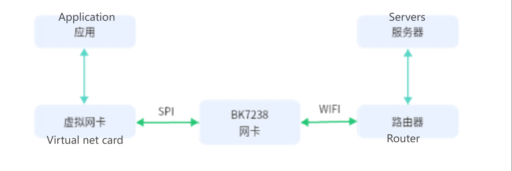

:link_to_translation:`zh_CN:[中文]`

=============================================
BK7238 low-power network interface solution
=============================================

Solution principle 
==============================

Currently, the common solution for IPC (Internet Protocol Camera) is to use a host controller with a Wi-Fi passthrough chip. The interface between the host controller and the passthrough chip is typically USB, SDIO, SPI, etc. With increasing demand for low power consumption, it is necessary to turn off the power of the host controller while keeping the Wi-Fi connection active to further reduce power consumption. However, the heartbeat with the server must be maintained, requiring the passthrough chip to support this functionality and have sufficiently low power consumption. Ordinary passthrough chips cannot meet the requirements.

The BK7238 chip adopts SPI to implement the network interface function, and customers can customize the heartbeat functionality with the server, achieving extremely low power consumption. Taking Junzheng T31 as an example, the schematic diagram of implementing this functionality with BK7238 is as follows:

    Solution Diagram

T31 features:

- Virtual network interface: Implements proprietary protocols between T31 and BK7238 through the SPI interface to achieve network data transmission and related control protocols such as sleep and network configuration. 
- Application layer: Audio/video capture,communication protocols with the server, etc.；

BK7238 features: 
  
- Network interface driver: Implements data communication with T31 through the SPI interface, receives and sends network data from T31, and handles proprietary protocols such as network configuration and sleep. 
- Application Layer: Implements functionality related to heartbeat maintenance, network configuration, sleep, and the specific application.

Solutin details
==============================

Working principle
------------------------------

- The host and BK7238 are connected via the SPI bus. The host creates a virtual network interface, with its MAC and IP addresses matching those of the mLAN device on the BK7238. This allows the network application on the host to communicate with the router connected to the BK7238 through the virtual network interface.

    Transport protocol diagram

The host acts as the SPI bus master, and the BK7238 acts as the SPI bus slave. They interact through a custom transport protocol. The host can initiate the transfer at any time. When the BK7238, as the slave, has data or events to be transmitted to the host, it notifies the host by pulling a GPIO pin high. The host detects the high level of the GPIO and initiates a read operation. The BK7238 should pull the GPIO low once all data or events have been transferred.

Transport protocol overview
------------------------------

- A complete transfer consists of two sub-phases.

::

	phase_1 : type(2B) + length(2B)
	phase_2 : type(2B) + length(2B) + data(n-B)

The high byte of the "type" field represents the direction of the phase_2 transfer, where OUT indicates from the master to the slave, and IN indicates from the slave to the master. The low byte of the "type" field represents the specific operation command, and "length" represents the length of the data.

.. important::
	- The "type" and "length" fields are encoded in big-endian format. 
	- Phase_1 is used for the host to inform the slave whether the upcoming phase_2 is an OUT operation or an IN operation, as well as the specific operation code.
	- Phase_2 is the actual DATA_OUT or DATA_IN transfer.

Transfer command code
------------------------------

::

	#define BK_SPI_DIR_IN 	0x1100
	#define BK_SPI_DIR_OUT 	0x2200

	#define BK_CMD_SET_WIFI (BK_SPI_DIR_OUT | 0x01)
	#define BK_CMD_SET_SLEEP (BK_SPI_DIR_OUT | 0x02)
	#define BK_CMD_CLEAR_EVENT (BK_SPI_DIR_OUT | 0x03)
	//...
	#define BK_CMD_WRITE_PKT (BK_SPI_DIR_OUT | 0x50)
	#define BK_DATA_VALID_OUT (BK_SPI_DIR_OUT | 0x5E)
	#define BK_DATA_VALID_OUT2 (BK_SPI_DIR_OUT | 0x6E)

	#define BK_CMD_GET_IP (BK_SPI_DIR_IN | 0x01)
	#define BK_CMD_GET_MAC (BK_SPI_DIR_IN | 0x02)
	//...
	#define BK_CMD_PEEK_PKT_LEN (BK_SPI_DIR_IN | 0x52)
	#define BK_CMD_READ_PKT (BK_SPI_DIR_IN | 0x53)
	#define BK_DATA_VALID_IN (BK_SPI_DIR_IN | 0xE5)
	#define BK_DATA_INVALID (BK_SPI_DIR_IN | 0xEE)

Command description
------------------------------

- BK_CMD_SET_WIFI

Set Wi-Fi connection parameters. The data consists of ssid and pwd, which are separated by byte 0x00. The data ends with 0x00.

::

	-> BK_CMD_SET_WIFI + 0x0000
	  
	-> BK_DATA_VALID_OUT + length + ssid + 0x00 + pwd + 0x00
  
  
- BK_CMD_SET_SLEEP

Set the BK7238 to enter low power mode.
::

	-> BK_CMD_SET_SLEEP + 0x0000

	-> BK_DATA_VALID_OUT + 0x0000

  

- BK_CMD_CLEAR_EVENT

Respond to the event reported by the BK7238: clear the corresponding event.
::

	-> BK_CMD_CLEAR_EVENT + 0x0000

	-> BK_DATA_VALID_OUT + 0x0002 + event_code(2B)

The "event_code" consists of two bytes encoded in big-endian format, where the high byte represents the event category, and the low byte represents the event sub-category.

  
- BK_CMD_WRITE_PKT

Send an Ethernet data packet. The "ether_pkt" includes a 14-byte Ethernet header.
::

	-> BK_CMD_WRITE_PKT + 0x0000
	  
	-> BK_DATA_VALID_OUT + length + ether_pkt

  
- BK_DATA_VALID_OUT2

Send an Ethernet data packet that includes a 14-byte Ethernet header. This is a special command defined to accelerate data transfer and does not include phase_1, only phase_2.
::

	-> BK_DATA_VALID_OUT2 + length + ether_pkt

  
- BK_CMD_GET_IP

Get the IP address of the BK7238. The IP address is a string in the format xxx.xxx.xxx.xxx, and ends with 0x00.
::

	-> BK_CMD_GET_IP + 0x0000
	  
	<- BK_DATA_VALID_IN + 0x0010 + ip_str + 0x00

  
- BK_CMD_GET_MAC

Get the MAC address of the BK7238. The MAC address is a string in the format xx:xx:xx:xx:xx:xx, and ends with 0x00.
::

	-> BK_CMD_GET_MAC + 0x0000

	<- BK_DATA_VALID_IN + 0x0012 + mac_str + 0x00

  
- BK_CMD_PEEK_PKT_LEN

Query the length of the next packet to be received by the BK7238. The length is a short type data encoded in big-endian format.
::

	-> BK_CMD_PEEK_PKT_LEN + 0x0000

	<- BK_DATA_VALID_IN + 0x0002 + next_pkt_len(2B)

Respond to the query with BK_DATA_INVALID when the BK7238 currently does not have any data packets to receive.
::

	-> BK_CMD_PEEK_PKT_LEN + 0x0000

	<- BK_DATA_INVALID + 0x0002 + 0x0000

  
- BK_CMD_READ_PKT

Read the incoming packet from the BK7238. The packets can be either event packets or network data packets. Both types of packets start with event_code, and the event_code definitions can be found in the BK_CMD_CLEAR_EVENT command. Following the event code is next_pkt_len, which indicates the data length of the next packet. When next_pkt_len is non-zero, the host can skip the BK_CMD_PEEK_PKT_LEN command and directly send the next BK_CMD_READ_PKT command to obtain the next packet.The length field represents the total length of the current packet, including event_code, next_pkt_len, and pkt_data.

::

	-> BK_CMD_READ_PKT + 0x0000

	<- BK_DATA_VALID_IN + length + event_code(2B) + next_pkt_len(2B) + pkt_data

For event packets, the host should use the BK_CMD_CLEAR_EVENT command to inform the BK7238 that the event has been processed.
  
  
Network interface card reserved ports
-----------------------------------------

- 	To reduce overall power consumption, the host is mostly in a power-off state, and the BK7238 acts on behalf of the host to maintain a heartbeat connection with the server.
-	When the server needs to communicate with the host that is in a power-off state, the BK7238 wakes up the host, and the host obtains server messages through the BK7238, allowing the host's power-on state to remain transparent to the server.

- 	Ports in the range of 0x1000 to 0x100F are reserved on the host. The BK7238 uses ports in this range for heartbeat service or other services.
-	When the BK7238 receives a packet from the port in the range, it does not report it to the host but processes it by itself.

Linux kernel configuration on the host
-----------------------------------------

The Linux kernel needs to enable the following configuration items:

-	CONFIG_TUN
-	CONFIG_SPI
-	CONFIG_SPI_MASTER
-	CONFIG_SPI_SPIDEV

Add the configuration description for the SPI bus and SPI device in the device tree (dts) configuration of the device. After the device starts up, there should be a device in the dev directory named spidevX.Y, such as spidev0.0. X is the SPI bus number, and Y is the chip select number.

Linux SPI bus operation on the host
-------------------------------------

- During initialization of the SPI bus, internal buffers are allocated using init_spi_buffers(), and the SPI device handle is obtained using spi_open(), and then the device control and network data transmission/reception can be performed using the interfaces provided in spi_protocol.h.
- spi_open() accepts two parameters: the device name and the bus clock rate. You can refer to the DEFAULT_DEV_NAME and DEFAULT_DEV_SPEED macro definitions in spi.h.

Code repositories
==============================

`BK7238 code repository <https://gitlab.bekencorp.com/wifi/customer/bk7238_sdk_release_for_junzhen>`_

`T31 driver code repository <https://gitlab.bekencorp.com/wifi/customer/bk7238_wlan_for_junzhen>`_
