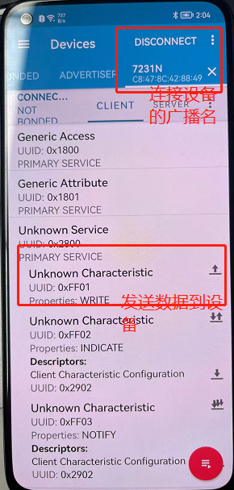

:link_to_translation:`en:[English]`

HTTP指令集
=================

--------------------------------------------
AT+HTTPCLIENT：发送 HTTP 客户端请求
--------------------------------------------

**执行命令**

命令：
::

	AT+HTTPCLIENT=<opt>,<content-type>,<url>,[<host>],[<path>],<transport_type>[,<data>][,<http_req_header>][,<http_req_header>][...]

返回：
::

	+HTTPCLIENT:<size>,<data>
	OK
	//<size>:size为接收数据的长度。
	//<data>:data为服务端响应的数据。

**参数**

- <opt>：HTTP 客户端请求方法

	+ 1: HEAD
	+ 2: GET
	+ 3: POST
	+ 4: PUT
	+ 5: DELETE

- <content-type>：客户端请求数据类型：

	+ 0: application/x-www-form-urlencoded
	+ 1: application/json
	+ 2: multipart/form-data
	+ 3: text/xml

- <url>：HTTP URL，当后面的 <host> 和 <path> 参数为空时，本参数会自动覆盖这两个参数<host>：域名或 IP 地址，<path>：HTTP 路径。
- <transport_type>：HTTP 客户端传输类型，默认值为 1：

	+ 1: HTTP_TRANSPORT_OVER_TCP
	+ 2: HTTP_TRANSPORT_OVER_SSL

- <data>: 当 <opt> 是 POST 请求时，本参数为发送给 HTTP 服务器的数据。当 <opt> 不是POST请求时，这个参数不存在（也就是，不需要输入逗号来表示有这个参数）。
- <http_req_header>: 可发送多个请求头给服务器。

**说明**

- 如果 url 参数不为空，HTTP 客户端将使用它并忽略 host 参数和 path 参数；如果 url 参数被省略或字符串为空，HTTP 客户端将使用 host 参数和 path 参数。

**示例**
::

	//HEAD 请求
	AT+HTTPCLIENT=1,0,http://httpbin.org/get,httpbin.org,/get,1

	//GET 请求
	AT+HTTPCLIENT=2,0,http://httpbin.org/get,httpbin.org,/get,1

	//POST 请求
	AT+HTTPCLIENT=3,0,http://httpbin.org/post,httpbin.org,/post,1,field1=value1&field2=value2

	TLS示例：
	//GET 请求
	AT+HTTPCLIENT=2,0,https://www.baidu.com/,www.baidu.com,/,2

	//POST 请求
	AT+HTTPCLIENT=3,0,https://www.baidu.com/,www.baidu.com,/,2,hello

-----------------------------------------------
AT+HTTPGETSIZE：获取 HTTP 资源大小
-----------------------------------------------

**执行命令**

命令：
::

	AT+HTTPGETSIZE=<url>

返回：
::

	+HTTPGETSIZE:<size>
	OK
	//<size>：url资源的大小

**参数**

- <url>：HTTP URL

**示例**
::

	AT+HTTPGETSIZE=http://www.baidu.com/img/bdlogo.gif

------------------------------------------
AT+HTTPCPOST：Post 指定长度的 HTTP 数据
------------------------------------------

**执行命令**

命令：
::

	AT+HTTPCPOST=<url>,<length>[,<http_req_header_cnt>][,<http_req_header>..<http_req_header>]

返回：
::

	OK
	>

符号 > 表示 AT 准备好接收串口数据，此时您可以输入数据，当数据长度达到参数 <length> 的值时，串口点击发送传输数据。 若传输成功，则返回：
::

	SEND OK

若传输失败，则返回：
::

	SEND FAIL

**参数**

- <url>：HTTP URL
- <length>：需 POST 的 HTTP 数据长度。最大长度2k
- <http_req_header_cnt>：<http_req_header> 参数的数量
- [<http_req_header>]：可发送多个请求头给服务器

**示例**
::

	AT+HTTPCPOST=http://httpbin.org/post,27
	
	>
	field1=value1&field2=value2

**说明**

- 当post发送数据时，> 后面输入数据的时候不能带\\r\\n。

------------------------------------------
AT+HTTPCERT：写CA证书数据到设备
------------------------------------------

**执行命令**

命令：
::

	AT+HTTPCERT=<type>,<length>

返回：
::

	OK

**参数**

- <type>：写入证书方式

	- 1: 根据length的长度来写证书数据ram中。
	- 2: 根据串口发送数据的长度的来写证书数据到ram中。

- <length>：根据type传过来的值进行设置，如果传1，则要知道证书的大小，传对应的值，如果传2，则任意值都可以，但需要一次性把证书的数据全部发送。

**示例**
::

	AT+HTTPSCERT=1,1280

	-----BEGIN CERTIFICATE-----
	MIIDdTCCAl2gAwIBAgILBAAAAAABFUtaw5QwDQYJKoZIhvcNAQEFBQAwVzELMAkG
	A1UEBhMCQkUxGTAXBgNVBAoTEEdsb2JhbFNpZ24gbnYtc2ExEDAOBgNVBAsTB1Jv
	b3QgQ0ExGzAZBgNVBAMTEkdsb2JhbFNpZ24gUm9vdCBDQTAeFw05ODA5MDExMjAw
	MDBaFw0yODAxMjgxMjAwMDBaMFcxCzAJBgNVBAYTAkJFMRkwFwYDVQQKExBHbG9i
	YWxTaWduIG52LXNhMRAwDgYDVQQLEwdSb290IENBMRswGQYDVQQDExJHbG9iYWxT
	aWduIFJvb3QgQ0EwggEiMA0GCSqGSIb3DQEBAQUAA4IBDwAwggEKAoIBAQDaDuaZ
	jc6j40+Kfvvxi4Mla+pIH/EqsLmVEQS98GPR4mdmzxzdzxtIK+6NiY6arymAZavp
	xy0Sy6scTHAHoT0KMM0VjU/43dSMUBUc71DuxC73/OlS8pF94G3VNTCOXkNz8kHp
	1Wrjsok6Vjk4bwY8iGlbKk3Fp1S4bInMm/k8yuX9ifUSPJJ4ltbcdG6TRGHRjcdG
	snUOhugZitVtbNV4FpWi6cgKOOvyJBNPc1STE4U6G7weNLWLBYy5d4ux2x8gkasJ
	U26Qzns3dLlwR5EiUWMWea6xrkEmCMgZK9FGqkjWZCrXgzT/LCrBbBlDSgeF59N8
	9iFo7+ryUp9/k5DPAgMBAAGjQjBAMA4GA1UdDwEB/wQEAwIBBjAPBgNVHRMBAf8E
	BTADAQH/MB0GA1UdDgQWBBRge2YaRQ2XyolQL30EzTSo//z9SzANBgkqhkiG9w0B
	AQUFAAOCAQEA1nPnfE920I2/7LqivjTFKDK1fPxsnCwrvQmeU79rXqoRSLblCKOz
	yj1hTdNGCbM+w6DjY1Ub8rrvrTnhQ7k4o+YviiY776BQVvnGCv04zcQLcFGUl5gE
	38NflNUVyRRBnMRddWQVDf9VMOyGj/8N7yy5Y0b2qvzfvGn9LhJIZJrglfCm7ymP
	AbEVtQwdpf5pLGkkeB6zpxxxYu7KyJesF12KwvhHhm4qxFYxldBniYUr+WymXUad
	DKqC5JlR3XC321Y9YeRq4VzW9v493kHMB65jUr9TU/Qr6cf9tveCX4XSQRjbgbME
	HMUfpIBvFSDJ3gyICh3WZlXi/EjJKSZp4A==
	-----END CERTIFICATE-----

	AT+HTTPSCERT=2,0

	-----BEGIN CERTIFICATE-----
	MIIDdTCCAl2gAwIBAgILBAAAAAABFUtaw5QwDQYJKoZIhvcNAQEFBQAwVzELMAkG
	A1UEBhMCQkUxGTAXBgNVBAoTEEdsb2JhbFNpZ24gbnYtc2ExEDAOBgNVBAsTB1Jv
	b3QgQ0ExGzAZBgNVBAMTEkdsb2JhbFNpZ24gUm9vdCBDQTAeFw05ODA5MDExMjAw
	MDBaFw0yODAxMjgxMjAwMDBaMFcxCzAJBgNVBAYTAkJFMRkwFwYDVQQKExBHbG9i
	YWxTaWduIG52LXNhMRAwDgYDVQQLEwdSb290IENBMRswGQYDVQQDExJHbG9iYWxT
	aWduIFJvb3QgQ0EwggEiMA0GCSqGSIb3DQEBAQUAA4IBDwAwggEKAoIBAQDaDuaZ
	jc6j40+Kfvvxi4Mla+pIH/EqsLmVEQS98GPR4mdmzxzdzxtIK+6NiY6arymAZavp
	xy0Sy6scTHAHoT0KMM0VjU/43dSMUBUc71DuxC73/OlS8pF94G3VNTCOXkNz8kHp
	1Wrjsok6Vjk4bwY8iGlbKk3Fp1S4bInMm/k8yuX9ifUSPJJ4ltbcdG6TRGHRjcdG
	snUOhugZitVtbNV4FpWi6cgKOOvyJBNPc1STE4U6G7weNLWLBYy5d4ux2x8gkasJ
	U26Qzns3dLlwR5EiUWMWea6xrkEmCMgZK9FGqkjWZCrXgzT/LCrBbBlDSgeF59N8
	9iFo7+ryUp9/k5DPAgMBAAGjQjBAMA4GA1UdDwEB/wQEAwIBBjAPBgNVHRMBAf8E
	BTADAQH/MB0GA1UdDgQWBBRge2YaRQ2XyolQL30EzTSo//z9SzANBgkqhkiG9w0B
	AQUFAAOCAQEA1nPnfE920I2/7LqivjTFKDK1fPxsnCwrvQmeU79rXqoRSLblCKOz
	yj1hTdNGCbM+w6DjY1Ub8rrvrTnhQ7k4o+YviiY776BQVvnGCv04zcQLcFGUl5gE
	38NflNUVyRRBnMRddWQVDf9VMOyGj/8N7yy5Y0b2qvzfvGn9LhJIZJrglfCm7ymP
	AbEVtQwdpf5pLGkkeB6zpxxxYu7KyJesF12KwvhHhm4qxFYxldBniYUr+WymXUad
	DKqC5JlR3XC321Y9YeRq4VzW9v493kHMB65jUr9TU/Qr6cf9tveCX4XSQRjbgbME
	HMUfpIBvFSDJ3gyICh3WZlXi/EjJKSZp4A==
	-----END CERTIFICATE-----

----------------------------------------------------
AT+OTA：设备OTA升级
----------------------------------------------------

**执行命令**

命令：
::

	AT+OTA=<url>

返回：
::

	OK
	//同时去下载升级文件到FLASH，下载完成之后启动bootloader进行升级。

**参数**

- <url>：升级文件的HTTP URL

**示例**
::

	AT+OTA=http://192.168.0.104/bk7231_bsp.rbl

----------------------------------------------------
AT+CWSTARTSMART：设备配网选择
----------------------------------------------------

**执行命令**

命令：
::

	AT+CWSTARTSMART=<type>,<auth floor>

返回：
::

	OK

**参数**

- <type>：类型

	- 1: ble
	- 2: AirKiss
	- 3:ble+AirKiss

- <auth floor>: Wi-Fi 认证模式阈值，暂不用此值，默认0

	- 0: OPEN（默认）
	- 1: WEP
	- 2: WPA_PSK
	- 3: WPA2_PSK
	- 4: WPA_WPA2_PSK
	- 5: WPA2_ENTERPRISE
	- 6: WPA3_PSK
	- 7: WPA2_WPA3_PSK

**示例**
::

	AT+CWSTARTSMART =1,0
	AT+CWSTARTSMART =2,0
	AT+CWSTARTSMART =3,0

**说明**

- airkiss配网是通过微信小程序物联网常用开发工具里面的airkiss配网，设备发送AT指令后在小程序输入账号和密码即可。
- BLE配网是设备通过AT指令发送ble广播名7238，NRF connect连上设备的蓝牙广播之后选择发送数据到设备，数据格式选择TEXT，数据参考如下：012TP-LINK_10860812345678

	- 第一个字节为数据类型，默认是0表示发送账号和密码。
	- 第二三个字节为ssid长度ssid_len如：12。
	- 第四到第N字节是通过ssid获取ssid的字串如TP-LINK_1086。
	- 第ssid_len+3+1个字节到ssid_len+3+2字节是passwd长度password_len如：08。
	- 第ssid_len+5+1个字节开始到ssid_len+5+1+password_len是passwd字串如：12345678。

Ble配网操作如图所示：

    step 1

.. figure:: ./../../_static/at_http_cwstartsmart2.png
    :align: center
    :alt: step_2
    :figclass: align-center

    step 2

----------------------------------------------------
AT+CWSTOPSMART：停止配网
----------------------------------------------------

**执行命令**

命令：
::

	AT+CWSTOPTSMART

返回：
::

	OK
