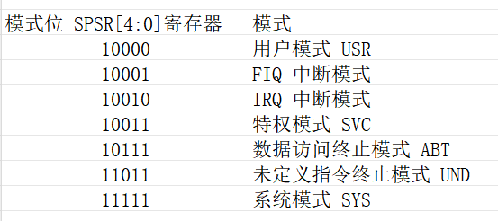

:link_to_translation:`en:[English]`

===================
系统调试
===================

BK7238系统异常重启案例分析
============================

当系统异常发生时会打印如下日志：

::

    data abort
    Current regs:
    r00:0x0040df91 r01:0x00001122 r02:0x00000000 r03:0x0000000a
    r04:0x00000001 r05:0x0040bc00 r06:0x0007cb81 r07:0x0040bba0
    r08:0x08080808 r09:0x09090909 r10:0x10101010
    fp :0x11111111 ip :0x00001868
    sp :0x004003d0 lr :0x0007cb5e pc :0x0007cb5e
    SPSR:0x0000003f
    CPSR:0x00000097
    
    separate regs:
    SYS:cpsr r8-r14
    0x0000009f
    0x08080808
    0x09090909
    0x10101010
    0x11111111
    0x00001868
    0x0041cd20
    0x0007cb7f
    
    IRQ:cpsr spsr r8-r14
    0x00000092
    0x6000001f
    0x08080808
    0x09090909
    0x10101010
    0x11111111
    0x00001868
    0x00401c08
    0x003f0fb4
    
    FIQ:cpsr spsr r8-r14
    0x00000091
    0x00000010
    0x00000000
    0x00000000
    0x00000000
    0x00000000
    0x00000000
    0x00400c18
    0x00e862ac
    
    ABT:cpsr spsr r8-r14
    0x00000097
    0x0000003f
    0x08080808
    0x09090909
    0x10101010
    0x11111111
    0x00001868
    0x004003c8
    0x0007cb5e
    
    UND:cpsr spsr r8-r14
    0x0000009b
    0x00000010
    0x08080808
    0x09090909
    0x10101010
    0x11111111
    0x00001868
    0x00400418
    0x9ec700a0
    
    SVC:cpsr spsr r8-r14
    0x00000093
    0x6000001f
    0x08080808
    0x09090909
    0x10101010
    0x11111111
    0x00001868
    0x004023d8
    0x00016e94
    
    shutdown...

首先要保留固件版本对应的 bk7231_bsp.elf 文件，通过ARM toolchain 工具dump成 asm 文件，使用如下指令:
::
  
  arm-none-eabi-objdump -d out/bk7231_bsp.elf >out/bk7231_bsp.asm

从异常log 中找到比较关键的几个点：

1.  SPSR寄存器：0x0000003f，查看ARM模式表可知异常前是 SYS mode
------------------------------------------------------------------------------

    图1 ARM 模式表

2.  PC寄存器：0x7cb5e
--------------------------------------

PC寄存器是一个通用寄存器，用于存储异常处理程序的地址。当发生异常（如中断或异常）时，处理器会将当前的指令地址保存到PC寄存器中，然后跳转到异常处理程序。

查看上面dump 出的bk7231_bsp.asm,0x7cb5e附近反汇编代码

::

  0007cb50 <printf_data_data_abort>:
     7cb50: b510        push  {r4, lr}
     7cb52: 4903        ldr r1, [pc, #12] ; (7cb60 <printf_data_data_abort+0x10>)
     7cb54: 3001        adds  r0, #1
     7cb56: 8001        strh  r1, [r0, #0]
     7cb58: 4802        ldr r0, [pc, #8]  ; (7cb64 <printf_data_data_abort+0x14>)
     7cb5a: f79c f85d   bl  18c18 <bk_printf>
     7cb5e: bd10        pop {r4, pc}
     7cb60: 00001122  .word 0x00001122
     7cb64: 000a37c5  .word 0x000a37c5

  0007cb68 <data_abort_test>:
     7cb68: 200a        movs  r0, #10
     7cb6a: b510        push  {r4, lr}
     7cb6c: f023 ffd4   bl  a0b18 <__os_malloc_from_thumb>
     7cb70: 2300        movs  r3, #0
     7cb72: 54c3        strb  r3, [r0, r3]
     7cb74: 3301        adds  r3, #1
     7cb76: 2b0a        cmp r3, #10
     7cb78: d1fb        bne.n 7cb72 <data_abort_test+0xa>
     7cb7a: f7ff ffe9   bl  7cb50 <printf_data_data_abort>
     7cb7e: bd10        pop {r4, pc}

.. important::
  由于ARM指令执行方式是流水线操作，即在对第1条指令开始执行的时候，可以同时对第2条指令进行译码操作，对第3条指令进行取指操作。
  所以问题出错在 0x7cb58 这条ldr指令.

从异常log看 r0=0x0040df91 是一个非四字节对齐的地址，进行字(word)读操作，导致出现非对齐异常访问。

3. SYS mode 对应r14(LR)寄存器：0x7cb7f
--------------------------------------

- LR 用于辅助PC 指针定位问题的。
- LR寄存器是一个通用寄存器，用于存储函数调用的返回地址。当一个函数调用另一个函数时，当前函数的返回地址会被保存到RA寄存器中，以便在子函数执行完毕后，能够正确返回到调用函数的下一条指令。
- 在函数调用过程中，LR寄存器的值通常是由调用方保存的，而在被调用的函数中，它被用于保存返回地址。当函数执行返回指令时，会从LR寄存器中读取返回地址，跳转到相应的位置继续执行。

