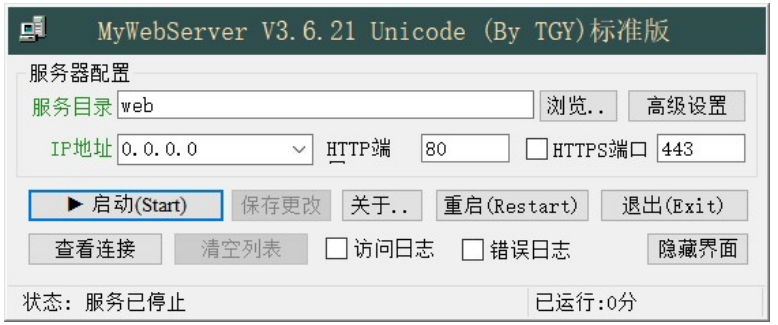

:link_to_translation:`en:[English]`

BK7256 压缩方式OTA介绍
========================

1、概述
----------------------------

 - 支持网络端远程升级固件，采用http协议从服务器下载ota固件，然后写入到OTA分区中，设备重启后bootloader会将ota分区的固件解压并拷贝到app运行分区，并加载新的app分区固件。
 - ota rbl固件支持压缩和加密，ota固件制作使用rt_ota_packaging_tool工具。

2、OTA升级流程介绍
----------------------------

.. figure:: ../../_static/ota_work.png
    :align: center
    :alt: ota_work
    :figclass: align-center

    图1 OTA 升级过程

2.1、 制作升级文件 
::

    进入到SDK 目录下，执行下面命令生成OTA 固件
    $ ./tools/rtt_ota/rt_ota_packaging_tool_cli-x64 -f out/bk7231_bsp.bin -v 1.0.1 -o out/bk7238_ota.bin -p app -c lzma  -s aes -k 0123456789ABCDEF0123456789ABCDEF -i 0123456789ABCDEF

2.2、 下载升级文件 

    - Application 应用程序中对应的下载管理器，将升级文件下载到 Flash 的 OTA 分区。
    - 如果没有HTTP服务器，可以先搭建本地HTTP Server环境进行http_ota的功能验证,自行下载MyWebServer3621.exe 或者其他本地http server 工具。
    - 以MyWebServer3621.exe 为例: 点击浏览按钮，选择存放步骤2.1生成的OTA固件文件的路径，点击启动
    - url为http://your_computer_ip/bk7238_ota.bin,浏览器输入后可以下载到bk7238_ota.bin，说明环境搭建成功。
    - 模块连接与电脑同一个路由器，通过cli 执行连接。

::

    连接路由器
    sta ssid password,

    下载固件
    http_ota http://your_computer_ip/bk7238_ota.bin   

    图2 MyWebServer3621.exe 界面

2.3、 重启进入 Bootloader 
    BK7238在下载完升级文件后，会自动重启系统，执行 Bootloader 程序

2.4、 更新固件 
    Bootloader 程序检测到 OTA 分区有升级文件，执行固件解压更新动作，并检验固件的完整性和合法性

2.5、执行 Application 
    固件更新并校验成功后，Bootloader 会引导执行 Application 程序，升级完成。

3、OTA升级失败分析
----------------------------
- 问题1: ota 下载完成重启后没有正常升级到目标程序
    首先要确认下bootload 分区表中的OTA 分区起始地址和长度跟代码分区表中的OTA 分区起始地址是对应的,分区表划分可参考 :doc:`/developer-guide/partition_specification/index`

- 问题2: ota 下载未完成
    首先要确认下要确认模块射频参数是否已校准，另外检查网络环境是否正常。
