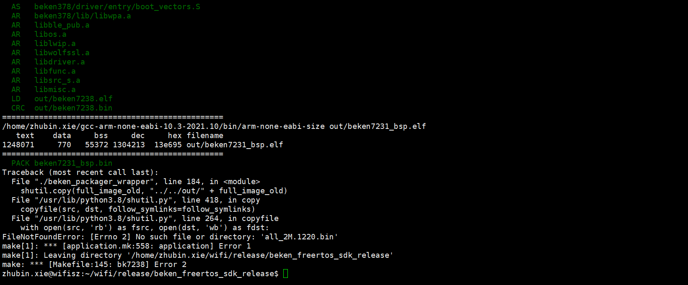
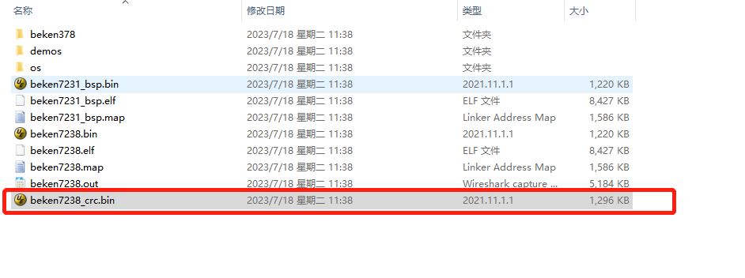
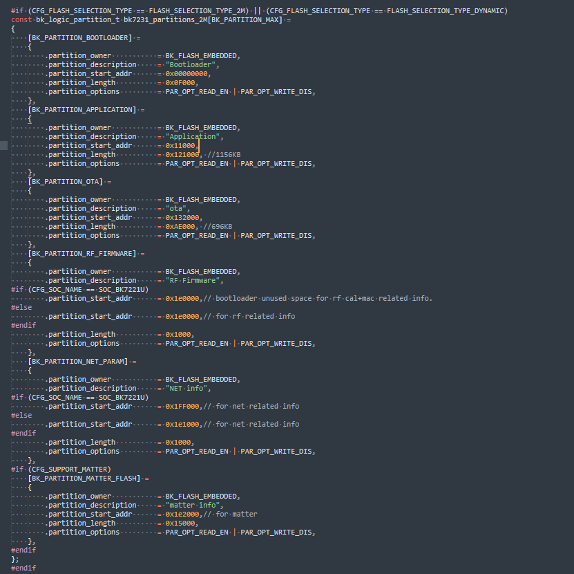

:link_to_translation:`en:[English]`

分区修改规范
========================

物理地址与逻辑地址的关系介绍
--------------------------------

为确保存储在flash中数据的准确性，每32个字节会增加2个字节crc校验位（crc检验由硬件自动完成。对比关系见下图1：（左侧为逻辑地址，右侧为物理地址，红色字体为crc校验）

.. figure:: ../../_static/logic.png
    :align: center
    :alt: logic
    :figclass: align-center

    图1物理地址与逻辑地址的对比

分区修改的组成
----------------------------
修改分区涉及到四个部分:

.. important::
  - 分区表规划
  - 打包脚本的配置文件修改
  - bootloader的分区表修改

案例
----------------------------

以bk7238为例，当用户在SDK基础上加入代码后，出现以下编译错误时见图2，该如何操作？

    图2 编译报错图示

    图3 编译输出的固件

有两个解决方案：

.. important::
  - 方案一：查看bk7238_crc.bin 大小超出的APP 分区很小，可关闭一些不需要的功能，减小code size；如果超出的code size很大，则只能实行方案二。
  - 方案二：如果超出的code size很大，则需要重新修改分区表，

分区表制作步骤如下：

- 1.app分区表制作：

  如flash物理总长度为2M，需在beken378/func/user_driver/BkDriverFlash.c 设定各个分区的partition_start_addr(物理地址)和partition_length(物理长度);

    图4 分区表(partition)图示

- 2.打包脚本配置：

  将tools/beken_packager/beken_packager_wrapper 中的start_addr和size根据图4分区表中各分区大小修改即可，（其中start_addr = partition_start_addr，
  size = partition_length；

.. figure:: ../../_static/bk_package.png
    :align: center
    :alt: bk_package
    :figclass: align-center

    图5 打包脚本配置图示

  
- 3.使用tools/rt_partition_tool/rt_partition_tool.exe 工具修改插入新的bootloader的分区表见 图6简要步骤如下：

  - 打开rt_partition_tool.exe工具
  - 加载tools/beken_packager/bootloader_bk7238_uart1_v1.0.14.bin
  - 修改对应分区表，注意这里offset 和length 都是逻辑地址，也就是不带CRC的
  - 文件/保存分区表到bootloader

.. figure:: ../../_static/bk_partition_tool.png
    :align: center
    :alt: bk_partition_tool
    :figclass: align-center

    图6 rt_partition_tool图示

分区功能介绍
----------------------------

各分区功能介绍如表格所示

+------------------+---------------+----------------+--------------------------------------------+
| partition name   | start address | length         | functional description                     |
+==================+===============+================+============================================+
| bootloader       | 0x00000000    | 0xf000         | Store bootloader                           |
+------------------+---------------+----------------+--------------------------------------------+
| app              | 0x11000       | 0x121000       | Store application image                    |
+------------------+---------------+----------------+--------------------------------------------+
| ota              | 0x132000      | 0xAE000        | store updating image                       |
+------------------+---------------+----------------+--------------------------------------------+
| RF_Firmware      | 0x1E1000      | 0x1000         | Store calibration parameter                |
+------------------+---------------+----------------+--------------------------------------------+
| NEI_info         | 0x1E2000      | 0x1000         | Store wifi mac address and fast connection |
|                  |               |                | parameter                                  |
+------------------+---------------+----------------+--------------------------------------------+

