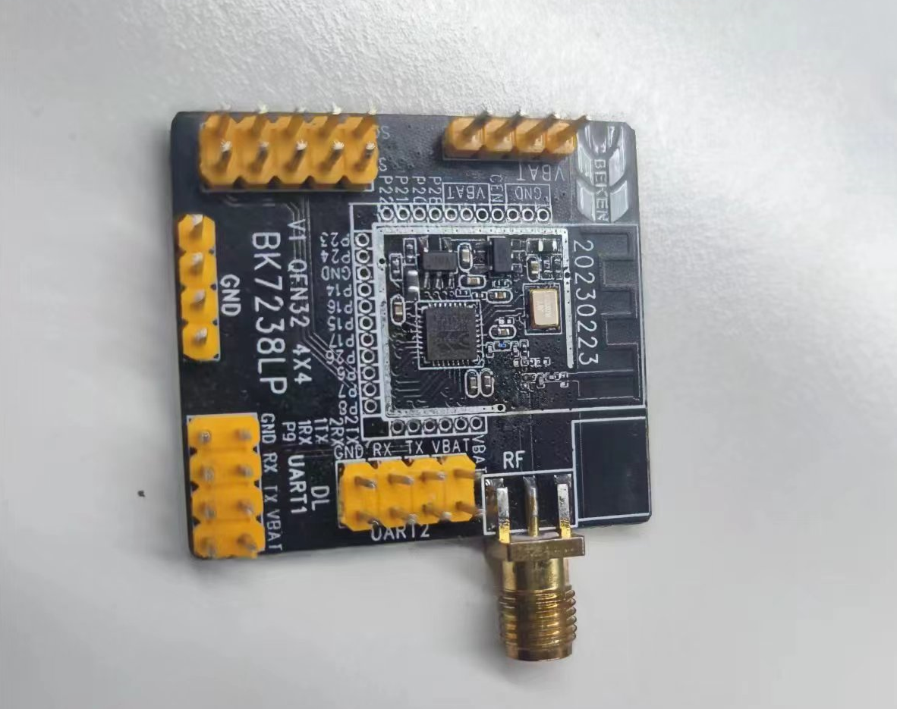
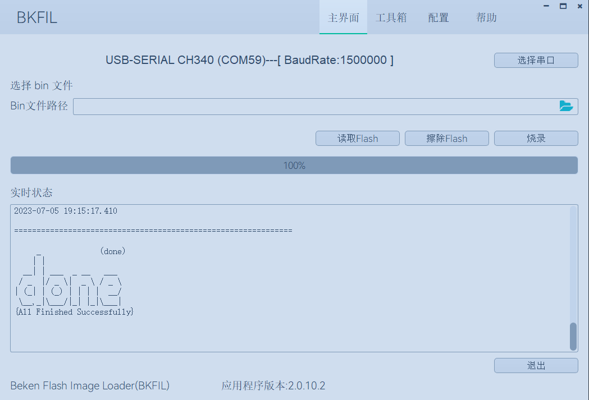
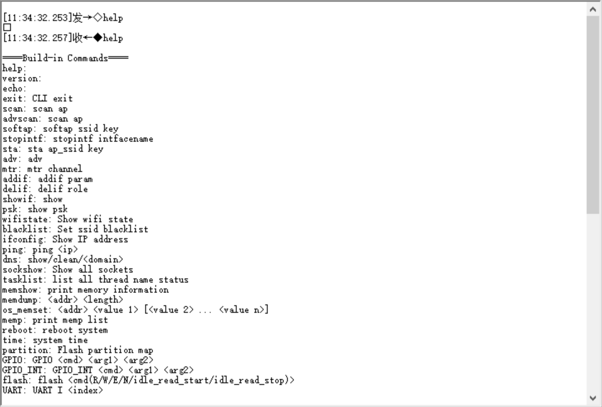

:link_to_translation:`en:[English]`

快速入门
=======================

本文档以 BK7238 开发板为例，通过一个简单的示例项目向您展示

 - 如何搭建BK7238 SDK 编译环境；
 - 如何编译、下载固件；

------------------------
准备工作
------------------------

硬件：
------------------------

 - BK7238 开发板
 - 串口烧录工具
 - 电脑（Windows 与 Ubuntu）

软件：
------------------------

 - ARM交叉工具链，用于编译 BK7238 SDK版本；
 - BK7238 SDK 源代码；
 - 串口烧录软件；

------------------------
开发板简介
------------------------

    BK7238 Demo Board

.. figure:: ./../_static/demo_board_bk7238_2.png
    :align: center
    :alt: demo_board_bk7238_2
    :figclass: align-center

    BK7238 Demo Board Back Side

------------------------------------
搭建编译环境
------------------------------------

BK7238 SDK代码下载
------------------------------------

您可从 gitlab 上下载 BK7238 SDK::

    git clone -b SDK_3.0.X https://gitlab.bekencorp.com/wifi/beken_freertos_sdk_release.git

也可以从 BEKEN 代理商 获取 BK7238 SDK

.. note::
    从官网的gitlab下载的为最近的SDK代码，相关账号找项目上审核申请。

工具链安装
------------------------

SDK_DIR/toolchain,在此目录下，如：gcc-arm-none-eabi-5_4-2016q3.tar.bz2

通过如下操作命令解压至用户目录下，/home/your_user_name/toolchain目录下::
    
    $ mkdir /home/your_user_name/toolchain
    $ tar -xvf toolchain/gcc-arm-none-eabi-5_4-2016q3.tar.bz2 -C  /home/your_user_name/toolchain

环境变量
------------------------
将工具链加入环境变量，首先打开环境配置文件::

    $ vim ~/.bashrc

将以下内容写入配置文件::

    export FREERTOS_EXEC_PATH=/home/your_user_name/toolchain/gcc-arm-none-eabi-5_4-2016q3/bin/

使能环境变量::

    $ source ~/.bashrc

.. note::
    当前支持Linux环境下编译，本章节将以Ubuntu 20.04 LTS版本为例，介绍整个编译环境的搭建,上述的your_user_name 需要改成自己主机的用户名

编译工程
------------------------------------

在终端下进入 BK7238 SDK 目录，执行编译,生成默认固件::

   $ make bk7238 -j4

编译matter 版本，可在sys_config_bk7238.h 中将matter宏使能，如::

#define CFG_SUPPORT_MATTER   1

再执行编译命令，生成matter 固件::   

   $ make bk7238 -j4

.. note::
    编译matter，需使用较新版本的编译器，如 `gcc-arm-none-eabi-10.3-2021.10 <https://developer.arm.com/downloads/-/gnu-rm/10-3-2021-10>`_。
    还需安装matter编译环境，见 `matter介绍 <https://gitlab.bekencorp.com/wifi/customer/matter>`_。

------------------------------------
烧录代码
------------------------------------

在 Windows 平台上， BK7238 目前支持 UART 烧录。

通过串口烧录
------------------------------------

.. note::

    BK7238支持UART烧录，推荐使用 CH340 串口工具小板进行下载。

串口烧录工具如下图所示:

.. figure:: ./../_static/download_tool_uart.png
    :align: center
    :alt: download_tool_uart
    :figclass: align-center

    UART

烧录工具获取：

	在线获取获取最新版本烧录工具：http://dl.bekencorp.com/tools/flash/，如：BEKEN_BKFIL_V2.0.10.6_20230615.zip

bk_writer.exe 界面及相关配置如下图所示：

    BKFIL GUI

烧录串口UART1，点击``烧录``进行版本烧录, 烧录完成之后掉电重启设备。

串口Log及Command Line
------------------------------------

- 目前BK7228平台，串口Log及Command Line命令输入在UART1口；可通过help命令查看支持命令列表::

    help //输出sdk 支持的命令列表

