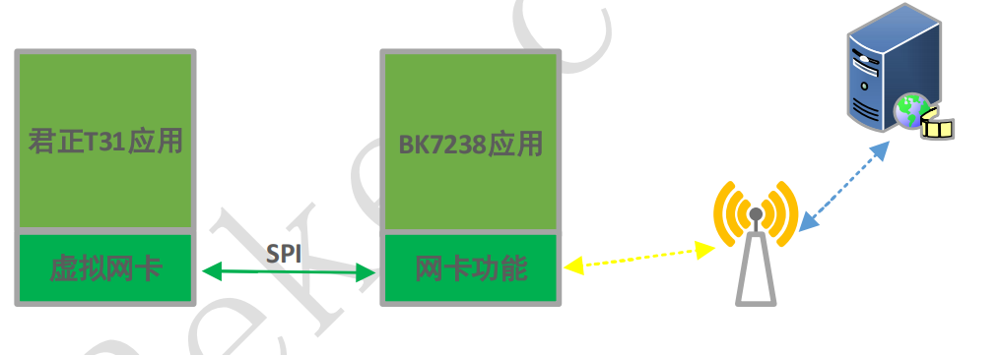
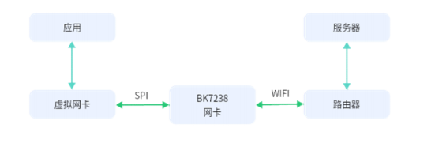

:link_to_translation:`en:[English]`

==============================
BK7238 低功耗网卡方案
==============================

方案原理 
==============================

目前 IPC 的方案普遍是由主控加 WIFI 透传芯片的方式，主控与透传芯片的接口一般是 USB、SDIO 或 SPI 等。随着对低功耗要求越来越高，在 WIFI 保活的情况下，必须关闭主控的电源进一步降低功耗，但
与服务器的心跳又必须维持，因此透传芯片必须能实现该功能，而且自身功耗也要足够低，普通的透传芯片无法满足要求。

BK7238 采用 SPI 实现网卡功能，并且客户可以定制与服务器之间保持心跳的功能，这样功耗可以做到极低。以君正 T31 主控为例，与BK7238 实现该功能的示意图如下：

    方案示意图

T31 功能:

- 虚拟网卡：通过 SPI 接口实现与 BK7238 之间的私有协议，完成网络数据传输，以及相关控制协议，如休眠、配网等； 
- 应用层：如音视频采集，与服务器之间的通讯协议等；

BK7238 功能: 
  
- 网卡驱动：通过 SPI 实现与 T31 的数据通讯，接收和发送 T31 的网络数据；处理配网、休眠等相关私有协议； 
- 应用层：实现心跳维持、配网、休眠以及方案应用的相关功能

方案细节
==============================

工作原理
------------------------------

- 主机与BK7238通过SPI总线连接, 主机端创建一个虚拟网卡, 其mac和ip地址与BK7238上的mlan设备保持一致。这样主机上的网络应用通过该虚拟网卡, 便可以与BK7238所连接的路由器进行通常的数据收发了。

    传输协议示意图

主机作为SPI总线的master, BK7238作为SPI总线的slave, 两者通过一个自定义的传输协议进行交互。主机可以随时发动传输, 
作为slave的BK7238当有数据或事件需要传送给主机时, 通过拉高一个gpio对主机进行通知, 主机监测到gpio的高电平后会发起读操作。
BK7238在数据或事件全部传输完毕后应将gpio拉低。

传输协议概述
------------------------------

- 一次完整的传输由两个子阶段组成。

::

	phase_1 : type(2B) + length(2B)
	phase_2 : type(2B) + length(2B) + data(n-B)

type的高字节表示phase_2的传输方向, 即OUT为主至从, IN为从至主。
type的低字节表示具体的操作命令，length表示data部分的长度。

.. important::
	- type与length都按大端编码。
	- phase_1用于主机告知从机接下来的phase_2是一个OUT操作还是一个IN操作, 以及具体的操作码。
	- phase_2则是真正的DATA_OUT或DATA_IN传输。

传输命令码
------------------------------

::

	#define BK_SPI_DIR_IN 	0x1100
	#define BK_SPI_DIR_OUT 	0x2200

	#define BK_CMD_SET_WIFI (BK_SPI_DIR_OUT | 0x01)
	#define BK_CMD_SET_SLEEP (BK_SPI_DIR_OUT | 0x02)
	#define BK_CMD_CLEAR_EVENT (BK_SPI_DIR_OUT | 0x03)
	//...
	#define BK_CMD_WRITE_PKT (BK_SPI_DIR_OUT | 0x50)
	#define BK_DATA_VALID_OUT (BK_SPI_DIR_OUT | 0x5E)
	#define BK_DATA_VALID_OUT2 (BK_SPI_DIR_OUT | 0x6E)

	#define BK_CMD_GET_IP (BK_SPI_DIR_IN | 0x01)
	#define BK_CMD_GET_MAC (BK_SPI_DIR_IN | 0x02)
	//...
	#define BK_CMD_PEEK_PKT_LEN (BK_SPI_DIR_IN | 0x52)
	#define BK_CMD_READ_PKT (BK_SPI_DIR_IN | 0x53)
	#define BK_DATA_VALID_IN (BK_SPI_DIR_IN | 0xE5)
	#define BK_DATA_INVALID (BK_SPI_DIR_IN | 0xEE)

命令说明
------------------------------

- BK_CMD_SET_WIFI

设置wifi连接参数, data由ssid与pwd组成, 两者由字节0x00隔开, 由0x00结尾

::

	-> BK_CMD_SET_WIFI + 0x0000
	  
	-> BK_DATA_VALID_OUT + length + ssid + 0x00 + pwd + 0x00
  
  
- BK_CMD_SET_SLEEP

设置BK7238进入低功耗模式
::

	-> BK_CMD_SET_SLEEP + 0x0000

	-> BK_DATA_VALID_OUT + 0x0000

  

- BK_CMD_CLEAR_EVENT

对BK7238所报事件的响应, 清除对应事件
::

	-> BK_CMD_CLEAR_EVENT + 0x0000

	-> BK_DATA_VALID_OUT + 0x0002 + event_code(2B)

event_code由两字节组成, 按大端编码,高字节为事件类型, 低字节为事件详细子类。

  
- BK_CMD_WRITE_PKT

发送以太网数据包, ether_pkt包含14字节的以太网包头
::

	-> BK_CMD_WRITE_PKT + 0x0000
	  
	-> BK_DATA_VALID_OUT + length + ether_pkt

  
- BK_DATA_VALID_OUT2

发送以太网数据包, 包含14字节的以太网包头。这是为了加速数据传输而特殊定义的命令, 没有phase_1, 仅包含phase_2。
::

	-> BK_DATA_VALID_OUT2 + length + ether_pkt

  
- BK_CMD_GET_IP

取得BK7238的IP地址, IP地址为xxx.xxx.xxx.xxx形式的字符串, 并以0x00结束。
::

	-> BK_CMD_GET_IP + 0x0000
	  
	<- BK_DATA_VALID_IN + 0x0010 + ip_str + 0x00

  
- BK_CMD_GET_MAC

取得BK7238的MAC地址, MAC地址为xx:xx:xx:xx:xx:xx形式的字符串, 并以0x00结束。
::

	-> BK_CMD_GET_MAC + 0x0000

	<- BK_DATA_VALID_IN + 0x0012 + mac_str + 0x00

  
- BK_CMD_PEEK_PKT_LEN

查询BK7238下一输入包的长度。下一输入包长度为以大端编码的一个short类型数据。
::

	-> BK_CMD_PEEK_PKT_LEN + 0x0000

	<- BK_DATA_VALID_IN + 0x0002 + next_pkt_len(2B)

当BK7238当前没有任何数据包需要输入时, 则以BK_DATA_INVALID响应查询。
::

	-> BK_CMD_PEEK_PKT_LEN + 0x0000

	<- BK_DATA_INVALID + 0x0002 + 0x0000

  
- BK_CMD_READ_PKT

读取BK7238的输入包。输入包分为两类:事件包及网络数据包, 两者都由event_code开头，event_code的定义见BK_CMD_CLEAR_EVENT 命令。紧跟event_code后面的是next_pkt_len, 表示
bk7238端下一包可读数据的长度, 当它不为0时, 主机可以省略一个BK_CMD_PEEK_PKT_LEN 命令, 直接发送下一个BK_CMD_READ_PKT 命令去取得下一包数据。length是包含event_code、
next_pkt_len和pkt_data的当前包总长度。

::

	-> BK_CMD_READ_PKT + 0x0000

	<- BK_DATA_VALID_IN + length + event_code(2B) + next_pkt_len(2B) + pkt_data

对于事件包, 主机在读取事件包后应通过BK_CMD_CLEAR_EVENT命令告知BK7238该事件已得到处理了
  
  
网卡保留端口
------------------------------

- 	为了降低整体功耗, 主机大部分时间处于掉电状态, 由BK7238代表主机, 与服务器保持心跳连接。
-	当服务器需要与处于掉电状态下的主机通讯时, BK7238为主机上电唤醒, 然后主机通过BK7238取得服务器消息，从而让主机的上电状态对服务器保持透明。

- 	在主机上保留0x1000~0x100F范围的端口, BK7238本身进行心跳服务或其它服务时使用该端口范围。
-	BK7238在收到该范围端口的数据包后, 并不向主机上报, 而是由自身进行处理。

主机端Linux内核配置
------------------------------

Linux内核需要打开以下配置项:

-	CONFIG_TUN
-	CONFIG_SPI
-	CONFIG_SPI_MASTER
-	CONFIG_SPI_SPIDEV

在设备的dts配置中添加spi bus及spi dev相关的配置描述, 确认设备启动后在/dev目录下存在形如spidevX.Y的设备, 如spidev0.0。X为spi总线编号, Y为片选编号。

主机端LinuxSPI总线操作
------------------------------

- 初始化SPI总线时, 通过init_spi_buffers()分配内部缓冲区, 通过spi_open()获得SPI设备句柄, 然后就可以使用spi_protocol.h中提供的接口进行设备控制与网络数据收发了。
- spi_open()接受两个参数 : 设备名称, 总线时钟速率。可参考spi.h中的DEFAULT_DEV_NAME, DEFAULT_DEV_SPEED宏定义。

代码仓库
==============================

`BK7238端代码仓库 <https://gitlab.bekencorp.com/wifi/customer/bk7238_sdk_release_for_junzhen>`_

`T31 端驱动代码仓库 <https://gitlab.bekencorp.com/wifi/customer/bk7238_wlan_for_junzhen>`_
